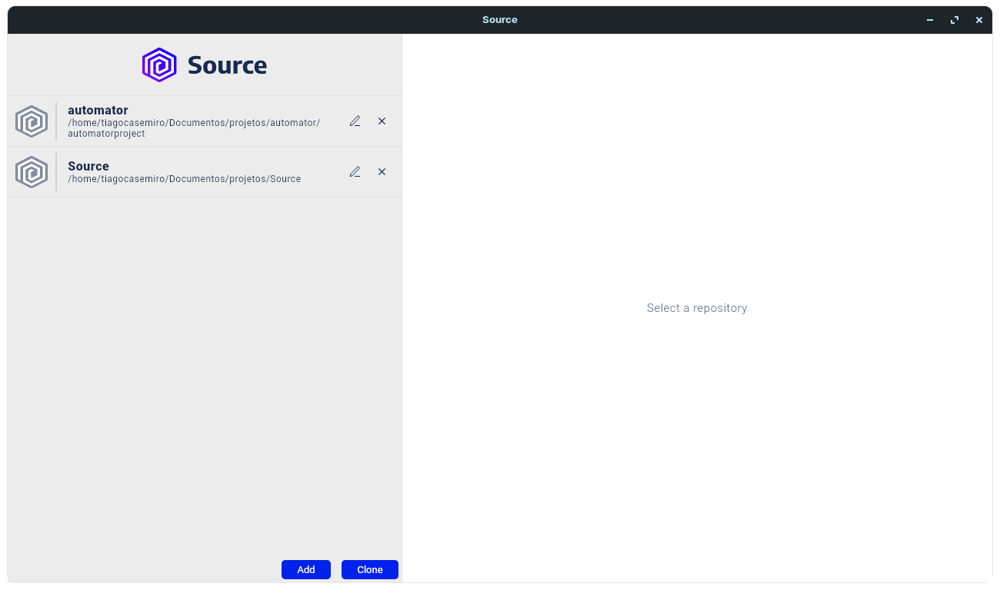
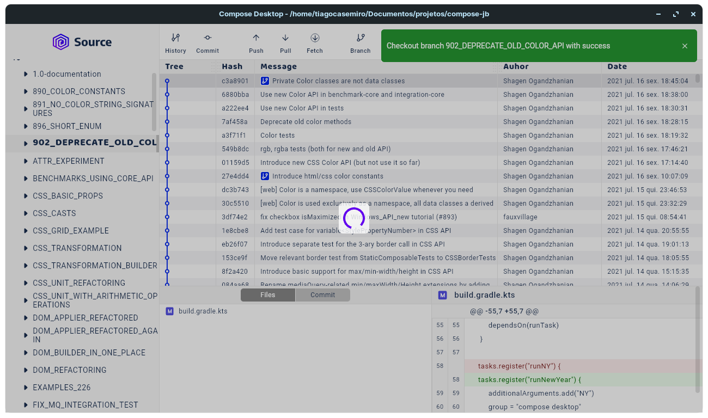
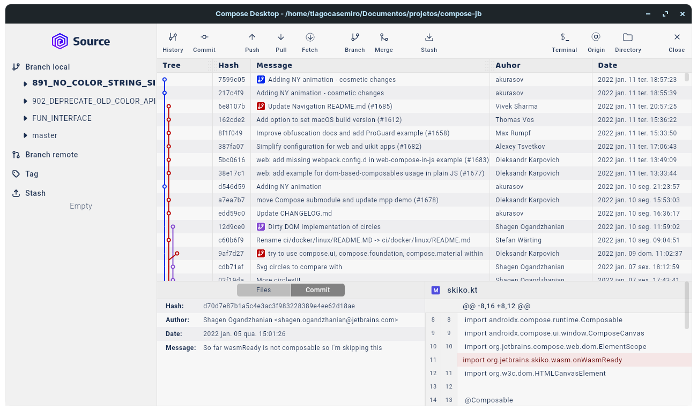
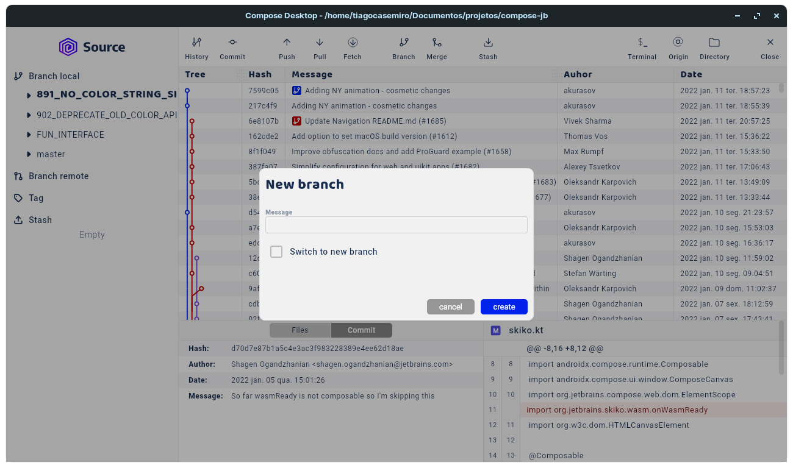
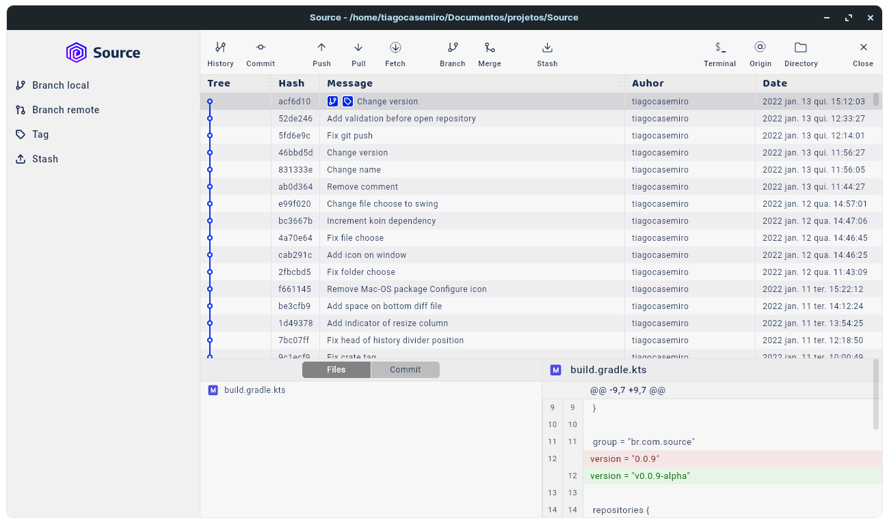

# Source
Source is a simple client for working with git. Functions: git push, git pull, git stash (create, apply), git merge, git branch, git delete branch, git history, git clone new repo, git open local repo.

